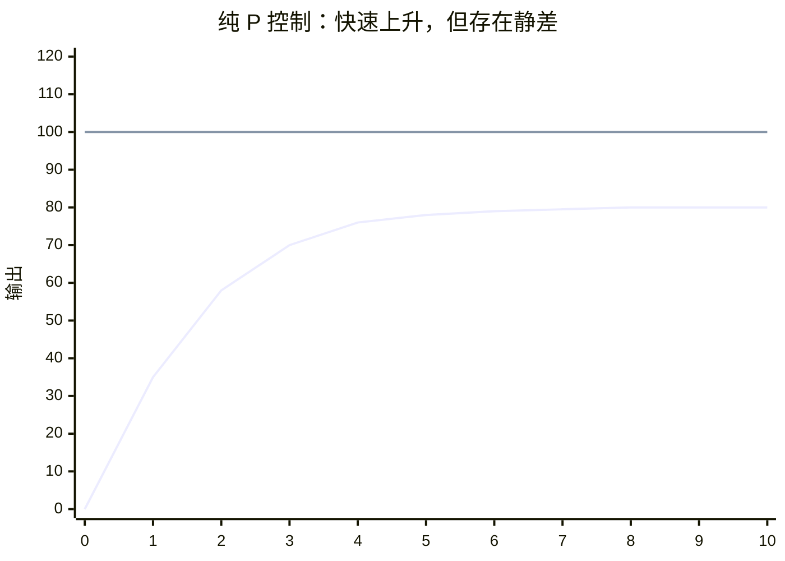
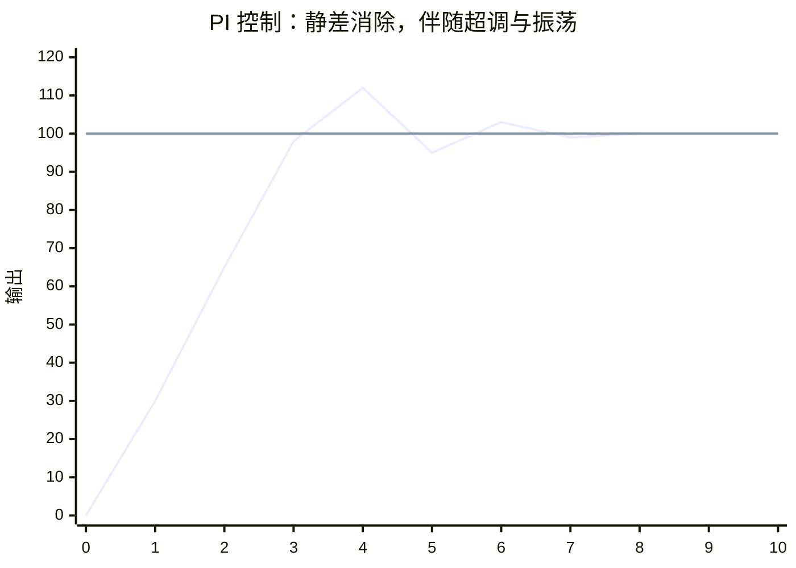
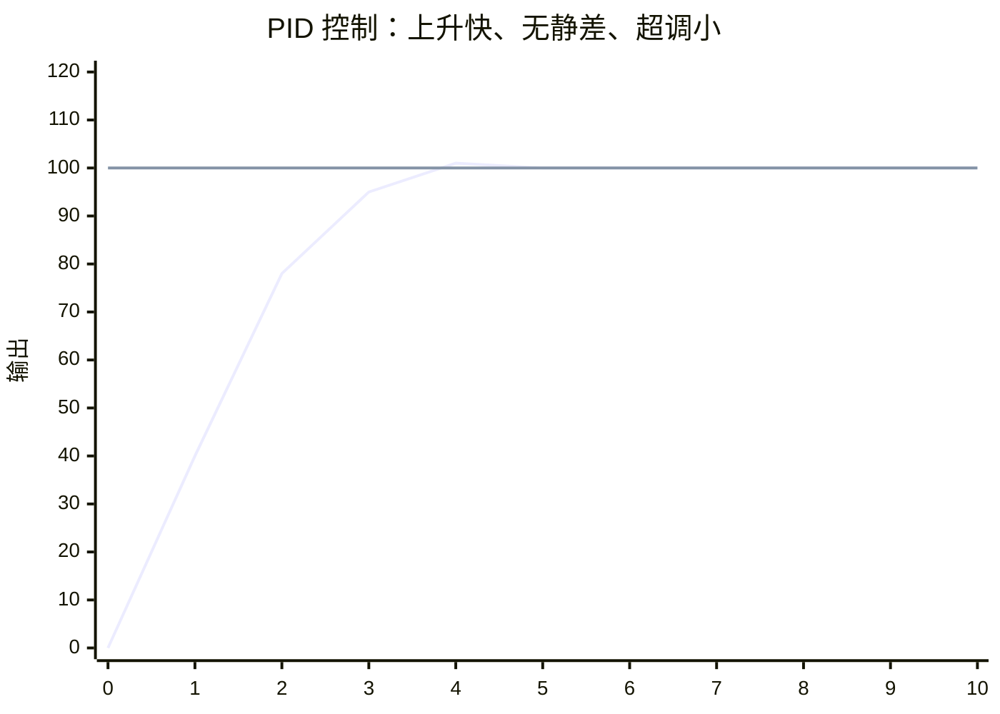
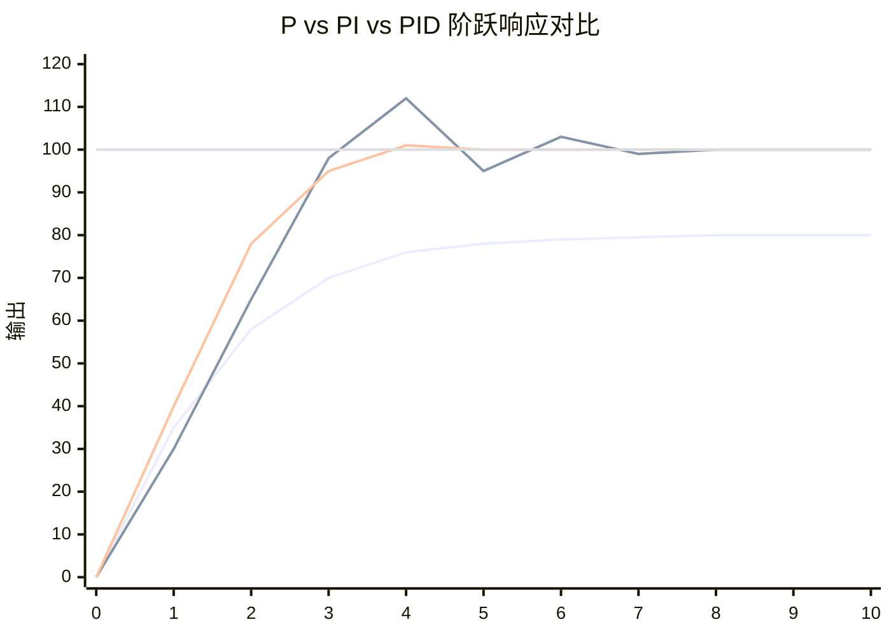

# 第二章：PID 核心思想与数学模型

---

## 2.0 从"调音量"到"调系统"

想象你在用旋钮调节音响音量。目标是把音量调到"刚刚好"的舒适水平。

- **你拧得太轻**：音量变化不明显，半天达不到目标。
- **你拧得太猛**：音量瞬间爆响，吓得你赶紧往回拧，结果又太小，来回折腾。
- **你拧得恰到好处**：快速接近目标，到跟前时放慢动作，稳稳停在理想位置。

PID 的三个环节，本质上就是在模拟一个"聪明的调节者"：

- **P** 告诉你"现在差多少，就使多大劲"
- **I** 告诉你"如果一直差一点点，就慢慢加力"
- **D** 告诉你"如果变化太快，先刹住车"

---

## 2.1 P（比例）：现在有多偏？

### 2.1.1 核心思想

比例控制是最直观的反馈：误差越大，输出越强。

$$
u_P(t) = K_p \cdot e(t)
$$

其中：

- $e(t) = r(t) - y(t)$ 是**误差**（目标值 - 实际值）
- $K_p$ 是**比例增益**
- $u_P(t)$ 是控制器输出的比例分量

### 2.1.2 物理直觉

把 $K_p$ 想象成**弹簧的刚度**：

- 误差像弹簧的拉伸量。拉得越远，弹簧拉力越大。
- $K_p$ 越大，弹簧越硬。小误差就能产生大回复力，系统响应快。
- 但弹簧太硬，一松手就会来回震荡（高 $K_p$ 导致超调）。

### 2.1.3 为什么 P alone 不够？

比例控制有一个**致命缺陷**：存在稳态误差（静差）。

**原因**：任何实际系统都有阻力。电机有摩擦、机械臂有重力、加热器有散热。当 $K_p \cdot e(t)$ 刚好等于阻力时，系统就"卡住了"——误差不再驱动输出变化，但目标还没达到。

> **例子**：你想让电机保持 3000 RPM。设 $K_p = 1$，当转速为 2900 RPM 时，误差 100，输出 100。但负载阻力恰好也是 100，电机就停在 2900 RPM 不动了。这个 100 RPM 的偏差就是**静差**。

增大 $K_p$ 可以减小静差，但无法消除——而且 $K_p$ 太大会导致系统振荡甚至失稳。

| $K_p$ 大小 | 效果 | 问题 |
|-----------|------|------|
| 太小 | 响应 sluggish，静差大 | 系统无力，迟迟达不到目标 |
| 适中 | 响应较快，有静差 | 需要配合 I 消除静差 |
| 太大 | 响应快，但超调大 | 容易振荡，甚至发散 |

---

## 2.2 I（积分）：过去欠了多少？

### 2.2.1 核心思想

积分控制把**历史误差全部累加**起来。只要曾经存在误差，积分就会持续"记账"，直到误差归零。

$$
\begin{aligned}
u_I(t) &= K_i \int_0^t e(\tau) \, d\tau \\
       &= K_p \cdot \frac{1}{T_i} \int_0^t e(\tau) \, d\tau
\end{aligned}
$$

其中：

- $K_i$ 是积分增益（也常表示为 $K_p / T_i$， $T_i$ 为积分时间常数）
- 积分项是误差曲线下的**面积**

### 2.2.2 物理直觉

把积分想象成**一个不断加水的水槽**：

- 只要有误差（水龙头开着），水槽水位就持续上升。
- 水位越高，输出的"压力"越大。
- 只有当误差彻底为零，水龙头关闭，水位才停止上涨。
- 如果系统有静差，水槽会不断蓄水，直到产生的压力足以克服阻力，把静差"顶掉"。

这就是积分消除静差的本质：**它不允许任何长期的"小偏差"存在。**

### 2.2.3 积分的代价：过犹不及

积分是"慢性子但记仇"的环节。它带来两个工程问题：

**① 积分饱和（Integral Windup）**

当执行器达到物理极限（电机满转、加热器最大功率），控制器输出已经饱和，但误差依然存在，积分项继续疯狂累加。等到误差反向时，这个"超蓄的水"需要很长时间才能排空，导致系统严重超调和滞后。

> **嵌入式场景**：你的电机 PWM 已经 100% 了，但负载太重转速上不去。如果积分继续累加，一旦负载减轻，电机不会立刻减速，而是会冲过头。

**② 相位滞后导致振荡**

积分是"看过去"的环节，它让控制器**反应慢半拍**。 $K_i$ 太大会让系统变得"犹豫"，在目标值附近来回震荡。

| $K_i$ 大小 | 效果 | 问题 |
|-----------|------|------|
| 无（纯 P） | 有静差 | 无法消除长期偏差 |
| 适中 | 静差消除，响应平滑 | 理想状态 |
| 太大 | 静差消除快 | 超调大，恢复慢，易振荡 |

---

## 2.3 D（微分）：未来会怎么偏？

### 2.3.1 核心思想

微分控制不看误差的大小，而看**误差变化的速度**。它提前"刹车"，抑制超调。

$$
\begin{aligned}
u_D(t) &= K_d \frac{de(t)}{dt} \\
       &= K_p \cdot T_d \frac{de(t)}{dt}
\end{aligned}
$$

其中：

- $K_d$ 是微分增益（也常表示为 $K_p \cdot T_d$， $T_d$ 为微分时间常数）
- $\frac{de(t)}{dt}$ 是误差的变化率

### 2.3.2 物理直觉

把微分想象成**汽车的 ABS 防抱死系统**：

- 你猛踩刹车（误差大，P 在发力），但车轮即将抱死（即将超调）。
- ABS 感知到减速太快（误差变化率太大），自动松开刹车一点。
- 它不是让你停得慢，而是让你**停得稳、不冲过头**。

在 PID 中，当系统快速接近目标值（误差在快速减小），D 项会产生一个**反向的制动力**，让系统在到达目标前就开始减速。

### 2.3.3 微分的代价：噪声放大器

微分是"最敏感也最脆弱"的环节：

**对噪声极度敏感**：传感器信号总带有高频噪声（ADC 量化噪声、电磁干扰）。噪声的幅值可能很小，但它的**变化率**可以非常大。微分会把这个微小的抖动放大成剧烈的控制输出，让执行器"颤抖"。

> **嵌入式噩梦**：你的编码器读数在 2999 和 3001 之间跳动（±1 的量化噪声），对 P 来说误差只是 ±1，影响不大。但对 D 来说，1ms 内从 2999 变到 3001，变化率是 2000/s，可能产生巨大的输出抖动。

**因此，在嵌入式实现中，D 项通常需要配合低通滤波，或者只在信噪比高的场景使用。**

| $K_d$ 大小 | 效果 | 问题 |
|-----------|------|------|
| 无（PI） | 可能超调，振荡衰减慢 | 对二阶系统不够"阻尼" |
| 适中 | 抑制超调，加速稳定 | 理想状态 |
| 太大 | 过度阻尼，响应迟钝 | 对噪声敏感，执行器抖动 |

---

## 2.4 三环节协同：一个完整的"智能体"

把 PID 三个环节合起来，就是控制器的完整输出：

$$
u(t) = K_p \cdot e(t) + K_i \int_0^t e(\tau) \, d\tau + K_d \frac{de(t)}{dt}
$$

或者写成标准形式：

$$
u(t) = K_p \left[ e(t) + \frac{1}{T_i}\int_0^t e(\tau) \, d\tau + T_d \frac{de(t)}{dt} \right]
$$

### 2.4.1 三者的角色分工

| 环节 | 时间维度 | 核心作用 | 典型问题 |
|------|---------|---------|---------|
| **P** | 现在 | 提供即时响应，决定系统"力量" | 有静差， $K_p$ 过大振荡 |
| **I** | 过去 | 消除静差，纠正长期偏差 | 积分饱和，相位滞后 |
| **D** | 未来 | 预测趋势，抑制超调 | 噪声放大，计算敏感 |

### 2.4.2 一个形象的比喻

想象你在开车去一个目的地（目标值），当前位置是实际值：

- **P**：你看着导航显示"还有 10 公里"，踩油门。距离越近，油门越轻。但如果遇到上坡（阻力），你停在离目的地 1 公里处，因为这点油门刚好抵消上坡阻力——这就是静差。
- **I**：你注意到已经开了半小时还没完全到，心里越来越急（积分累加），慢慢把油门再踩深一点，直到彻底到达。
- **D**：你看到导航显示"距离在快速缩小"，预判"再这么开要冲过头了"，提前松油门甚至轻踩刹车，让车平稳停下。

---

## 2.5 时域视角：阶跃响应的"性格画像"

给系统一个**阶跃输入**（突然把目标值从 0 改到 100），观察输出如何变化，是理解 PID 最直观的方式。

### 2.5.1 纯 P 控制

- 快速上升，但永远达不到目标（有静差）。响应曲线与目标值参考线之间的差距就是静差。
- $K_p$ 越大，静差越小，但上升过程振荡越明显。

### 2.5.2 PI 控制

- 静差最终被消除（I 的作用），响应曲线最终与目标值参考线重合。
- 但可能产生超调和振荡（I 的相位滞后），峰值约 112。
- 振荡幅度取决于 $K_i$ 和 $K_p$ 的配比。

### 2.5.3 PID 控制

- 上升快（P），无静差（I），超调小（D）。响应曲线仅轻微越过目标（101）后迅速收敛。
- D 的"刹车"作用让曲线更平滑，更快收敛。

### 2.5.4 三图对比

将三种控制方式的阶跃响应放在同一坐标系中，可以直观对比它们的"性格差异"：

> **对应关系**（按线条出现顺序）：第一条 → P 控制 | 第二条 → PI 控制 | 第三条 → PID 控制 | 第四条 → 目标值

| 控制类型 | 上升速度 | 静差 | 超调 | 收敛速度 |
|---------|---------|------|------|---------|
| **P**   | 快      | 有   | 无   | 慢（指数趋近） |
| **PI**  | 快      | 无   | 大   | 中（振荡衰减） |
| **PID** | 快      | 无   | 极小 | 快（迅速平稳） |

### 2.5.5 性能指标

评价一个控制系统，工程师关注四个指标：

| 指标 | 含义 | PID 环节影响 |
|------|------|-------------|
| **上升时间** $T_r$ | 从 10% 到 90% 目标值的时间 | $K_p$ ↑ 则 $T_r$ ↓ |
| **超调量** $M_p$ | 超过目标值的最大百分比 | $K_d$ ↑ 则 $M_p$ ↓ |
| **调节时间** $T_s$ | 进入并保持在误差带内的时间 | 三者协同优化 |
| **稳态误差** $e_{ss}$ | 稳定后与目标的偏差 | $K_i$ 存在则 $e_{ss}$ → 0 |

> **工程权衡**：这四个指标往往互相矛盾。比如增大 $K_p$ 缩短上升时间，但可能增大超调。PID 调参的本质就是在这四个指标之间找到最佳平衡点。

---

## 2.6 频域视角：传递函数的"体检报告"（点到为止）

时域让我们"看"系统的性格，频域让我们"懂"系统的本质。

### 2.6.1 连续域传递函数

对 PID 的时域方程做拉普拉斯变换，得到传递函数：

$$
G_c(s) = K_p + \frac{K_i}{s} + K_d \cdot s = K_p \left( 1 + \frac{1}{T_i s} + T_d s \right)
$$

- **P 项**：常数 $K_p$，在所有频率下增益相同。
- **I 项**： $\frac{1}{s}$，低频增益极高（消除静差，因为静差是 $s \to 0$），高频增益低。
- **D 项**： $s$，高频增益极高（对快速变化敏感），低频增益低。

### 2.6.2 频域直觉

| 环节 | 低频（慢变化） | 高频（快变化） |
|------|--------------|---------------|
| P | 有增益 | 有增益 |
| I | 增益极高（消除静差） | 增益极低（忽略噪声） |
| D | 增益极低（忽略漂移） | 增益极高（抑制快速振荡） |

这解释了为什么：

- I 能消除静差（静差是极低频信号，I 在低频"放大器"）。
- D 能抑制振荡但放大噪声（振荡和噪声都是高频，D 一视同仁）。

### 2.6.3 对嵌入式工程师的意义

你不需要手动推导传递函数，但需要理解：

- **波特图**（Bode Plot）可以告诉你：系统在什么频率下会振荡？（相位穿越 180° 时的增益裕度）
- **奈奎斯特判据**可以判断：我的 PID 参数是否会让系统不稳定？
- 这些工具通常在 MATLAB/Simulink 或 Python 中离线分析，然后把安全的参数烧录到 MCU 中。

> **实践建议**：在嵌入式开发前，先用仿真工具画出系统的波特图，预估稳定的 $K_p$ 范围，再上板调试。这能避免很多"烧电机"的惨痛教训。

---

## 2.7 本章小结

| 核心概念 | 一句话总结 |
|---------|-----------|
| **P（比例）** | 误差多大，力气多大；有力气但有静差 |
| **I（积分）** | 秋后算账，静差必除；但记仇太多会坏事 |
| **D（微分）** | 见微知著，提前刹车；但神经过敏怕噪声 |
| **时域** | 看阶跃响应曲线，直观感受快慢、超调、振荡 |
| **频域** | 看传递函数，从数学上预判稳定性边界 |

---

## 2.8 下章预告

第二章我们建立了 PID 的"大脑模型"。第三章将把这个模型**烧进单片机**：

- 连续 PID 如何变成离散 PID？位置式 vs 增量式，选哪个？
- 在 STM32 上写一段 PID 代码，要注意哪些数值陷阱？
- 采样周期怎么选？积分饱和怎么防？微分噪声怎么滤？
- 定点数还是浮点数？中断里跑还是主循环里跑？

**从数学公式到 C 语言代码，从理想世界到真实 MCU。**

---

> **思考题**：假设你正在调一个温度控制系统（一阶惯性），发现系统响应很慢但几乎没有超调。你会先调 $K_p$、 $K_i$ 还是 $K_d$？为什么？如果换成电机位置控制（二阶振荡），同样的现象，你的调参策略会不同吗？

---

> **上一篇**：[01 → 引言与预备知识](./01_引言与预备知识.md) | **下一篇**：[03 → 从连续到离散——嵌入式实现路径](./03_从连续到离散.md)
